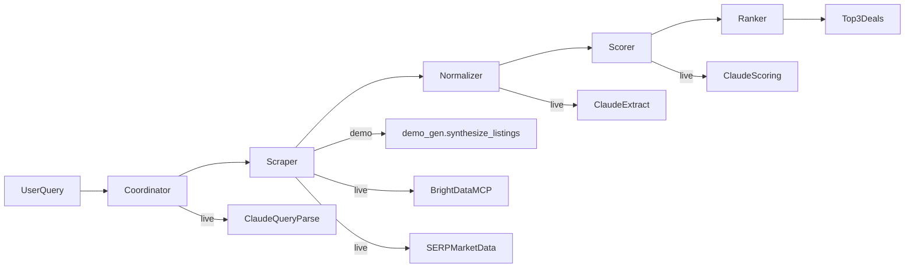

# DealPulse Scout — Architecture

## Overview

DealPulse Scout is a LangGraph **StateGraph** with five agent nodes. A user types a natural-language car search; the pipeline returns the top 3 ranked deals with scores, reasons, and marketplace links.

## Pipeline Flow

Entry point: [`agents/graph.py`](../agents/graph.py) — `build_graph()` wires nodes sequentially; `run_search_stream()` emits SSE events per node.

## Agent Responsibilities

### Coordinator (`agents/coordinator.py`)

- Input: raw query string (e.g. `BMW X5 Austin under 75k`)
- Output: `plan` dict — `{make, model, location, max_price, keywords, year_min, year_max}`
- Uses Claude when available; falls back to heuristic parser in `agents/query_parse.py`
- Heuristic parser handles city aliases, budget patterns (`under 75k`), and known make casing (BMW, GMC, etc.)

### Scraper (`agents/scraper.py`)

**Demo mode** (`DEMO_MODE=true`):

- Resolves plan from state or re-parses query
- Calls `db/demo_gen.synthesize_listings()` — no network calls
- Emits synthetic raw scrapes for downstream nodes

**Live mode**:

- Builds search URLs for CarGurus, AutoTrader, Craigslist
- Invokes Bright Data MCP tools (`search_engine`, `scraping_browser`, `scrape_as_markdown`)
- Collects raw HTML/markdown per source; errors are logged per-source, not fatal

### Normalizer (`agents/normalizer.py`)

**Demo mode**:

- Always re-synthesizes listings from plan (pipeline v2 — no SQLite cache fallback)
- Ensures consistent structured output regardless of scraper payload shape

**Live mode**:

- Sends raw scrape content to Claude for JSON extraction
- Rule-based fallback when LLM unavailable

### Scorer (`agents/scorer.py`)

**Demo mode**:

- Pass-through when listings already carry `deal_score` from `demo_gen`
- Filters by requested make to avoid cross-brand leakage

**Live mode**:

- Claude compares each listing to SERP market data
- Rule-based fallback: `% below estimated market` formula with varied premiums per listing index

### Ranker (`agents/ranker.py`)

- Sorts by `deal_score` descending
- Returns top 3 with `rank` 1–3
- Emits summary events for SSE log stream

## State Shape

Defined in `agents/state.py` as `DealScoutState`:

| Field | Set by | Purpose |
|-------|--------|---------|
| `query` | Input | Original user string |
| `plan` | Coordinator | Parsed search parameters |
| `raw_scrapes` | Scraper | Raw content per source |
| `listings` | Normalizer | Structured listing dicts |
| `market_data` | Scraper (live) | SERP snippets for scoring |
| `scored_deals` | Scorer | Listings + scores + reasons |
| `top_deals` | Ranker | Final top 3 |
| `events` | All nodes | Human-readable log lines for SSE |

## Demo URL Building

`db/urls.py` constructs marketplace deep links:

- **CarGurus:** `makeModelTrimPaths` entity IDs (make `m#`, model `d#`) + ZIP from `db/geo.py` + `maxPrice`
- **AutoTrader:** make/model/city path + ZIP + max price
- **Craigslist:** city subdomain + query string

Demo listings intentionally link to **search results**, not individual VINs — judges can verify real inventory exists for the requested make/model/area.

Known entity IDs include BMW X5 (`m3/d393`), Porsche Panamera (`m43/d824`), Lamborghini Huracán (`m34/d2285`). Unknown makes fall back to make-only or alternate sources.

## API Layer

`api/main.py`:

- `GET /health` — returns `{status, demo_mode, pipeline: "v2"}`
- `GET /search?q=...&stream=true` — SSE stream of agent logs + final `result` event
- `GET /search?q=...&stream=false` — JSON response with `deals` array

## UI Layer

`ui/app.py` (Streamlit):

- Consumes SSE from API
- Renders expandable deal cards with price, market avg, mileage, score, reason
- Shows agent log panel (last 20 lines)
- Health check in sidebar — warns if pipeline ≠ v2
- Offline fallback: local `synthesize_listings()` if API unreachable

## SQLite Cache

`db/cache.py` — legacy seed data and optional persistence for live scrapes. **Not used** in demo hot path since pipeline v2. Initialized on API startup via `cache.init_db()` / `cache.seed_demo_data()`.

## Configuration

`config.py` reads `.env`:

- `DEMO_MODE` — default `true` for hackathon reliability
- `BRIGHT_DATA_TOKEN`, `ANTHROPIC_API_KEY` — required for live mode
- `API_HOST`, `API_PORT`, `API_URL`
